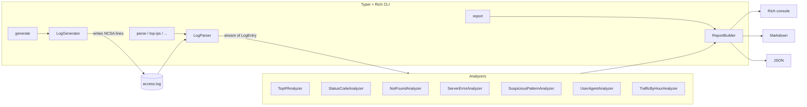

# log-analyzer-cli

> A polished, Rich-powered Python CLI that **generates** realistic NCSA Combined access logs and **analyzes** them for traffic, errors, and **security signals**.

`log-analyzer-cli` is a single-file install, zero-config tool for engineers who want to demo log-analysis pipelines, prototype incident-response queries, or hand juniors a sandbox full of believable-looking traffic — including SQL-injection probes, brute-force POSTs, dirbusting sweeps, and `.env` leak attempts.

## Highlights

- **Realistic synthetic logs** — long-tail IP distribution, diurnal traffic curve, browser/bot mix, full status-code spread, and ~0.5% embedded suspicious requests by default.
- **Object-oriented analyzers** — one class per concern, every analyzer returns a JSON-serializable `AnalysisResult` and its own Rich renderer.
- **Three report formats** — Rich tables, GitHub-flavored Markdown, machine-readable JSON.
- **First-class security view** — admin probes, config leaks, SQLi/XSS payloads, path traversal, RCE probes, dirbusting, brute-force POSTs, offensive-tool User-Agents.
- **Tested** — 50+ pytest cases across parser, generator, analyzers, report builder, and CLI runner.

## Demo

```text
$ log-analyzer generate --out access.log --lines 100000 --days 7
                          Generation complete
+-----------------------------------------------------------------+
| File: access.log                                                |
| Lines: 100,000                                                  |
| Suspicious: 489 (0.49%)                                         |
| Unique IPs: 348                                                 |
| Window: 7 day(s)                                                |
+-----------------------------------------------------------------+

$ log-analyzer suspicious access.log
                            Suspicious requests
+----------+--------------+------+-----------------------------------+
| Severity | Category     | Hits | Example                           |
+----------+--------------+------+-----------------------------------+
| CRITICAL | config-leak  |   71 | 203.0.113.5 GET /.env             |
| CRITICAL | sql-injection|   58 | 198.51.100.7 GET /api/v1/products |
| CRITICAL | rce-probe    |   12 | 192.0.2.4 GET /actuator/env       |
| HIGH     | admin-probe  |  142 | 198.51.100.7 GET /wp-login.php    |
| HIGH     | xss          |   34 | 203.0.113.5 GET /search?q=<svg... |
| HIGH     | brute-force  |  121 | 192.0.2.4 -> 121 POST /login      |
| MEDIUM   | dirbuster    |   77 | 198.51.100.7 GET /backup          |
| MEDIUM   | bad-ua       |  483 | 192.0.2.4 GET /admin              |
+----------+--------------+------+-----------------------------------+
```

## Install

```bash
git clone https://github.com/seyyidsahin2834/log-analyzer-cli.git
cd log-analyzer-cli
python -m pip install -e .
```

Python 3.13+ required. Dev extras (pytest, coverage) install via `pip install -e ".[dev]"`.

## Commands

| Command | What it does |
| --- | --- |
| `generate` | Produce a synthetic NCSA Combined access log. |
| `parse` | Show the first/last N parsed entries as a Rich table. |
| `top-ips` | Rank source IPs by request volume. |
| `status-codes` | Aggregate HTTP status codes (with class buckets). |
| `not-found` | List the most-requested 404 paths. |
| `server-errors` | Group 5xx responses by path and code. |
| `suspicious` | Detect admin probing, SQLi/XSS, dirbusting, brute force, etc. |
| `report` | Run all analyzers and emit a Rich, Markdown, or JSON report. |

Run `log-analyzer <command> --help` for full per-command examples.

## Architecture



Each analyzer implements:

```python
class BaseAnalyzer:
    def analyze(self, entries: Iterable[LogEntry]) -> AnalysisResult: ...
    def render(self, result: AnalysisResult, console: Console) -> None: ...
```

`AnalysisResult` is a small dataclass with `name`, `title`, `summary`, and a JSON-friendly `data` payload. This split is what lets `report` emit Rich, Markdown, or JSON from the same in-memory results.

## Detected suspicious patterns

| Category | Severity | Detection |
| --- | --- | --- |
| `config-leak` | critical | `/.env`, `/.git/config`, `/.aws/credentials`, leaked backups |
| `sql-injection` | critical | classic SQLi payloads (`' OR 1=1`, `UNION SELECT`, `DROP TABLE`) |
| `rce-probe` | critical | Ignition, Spring `actuator/env`, PHPUnit eval-stdin |
| `shellshock` | critical | Shellshock probes embedded in User-Agent |
| `admin-probe` | high | `/wp-login.php`, `/phpmyadmin`, `/admin/...` |
| `xss` | high | `<script>`, `onerror=`, `javascript:`, `<svg onload=...>` |
| `path-traversal` | high | `../../`, percent-encoded variants |
| `brute-force` | high | repeated `POST /login` per IP above threshold |
| `dirbuster` | medium | hidden-resource enumeration (`/backup`, `/staging`, ...) |
| `bad-user-agent` | medium | `sqlmap`, `nikto`, `nmap`, `masscan`, etc. |

## Example reports

Sample output lives in [`examples/`](examples/):

- `examples/sample.log` — 1,000-line deterministic synthetic log
- `examples/report.md` — Markdown report generated from the above
- `examples/report.json` — JSON report generated from the above

Regenerate with:

```bash
make demo                      # generate + show top-ips, status-codes, suspicious
log-analyzer report examples/sample.log --format markdown --out examples/report.md
log-analyzer report examples/sample.log --format json --out examples/report.json
```

## Run

```bash
log-analyzer generate --out access.log --lines 100000 --days 7
log-analyzer report access.log --format rich
log-analyzer report access.log --format markdown --out report.md
log-analyzer suspicious access.log --brute-force-threshold 5
```

## Test

```bash
python -m pip install -e ".[dev]"
pytest -v
```

## Screenshots

| Generation | Suspicious dashboard |
| --- | --- |
| _generation panel placeholder_ | _suspicious table placeholder_ |

## License

MIT - see [LICENSE](LICENSE).
